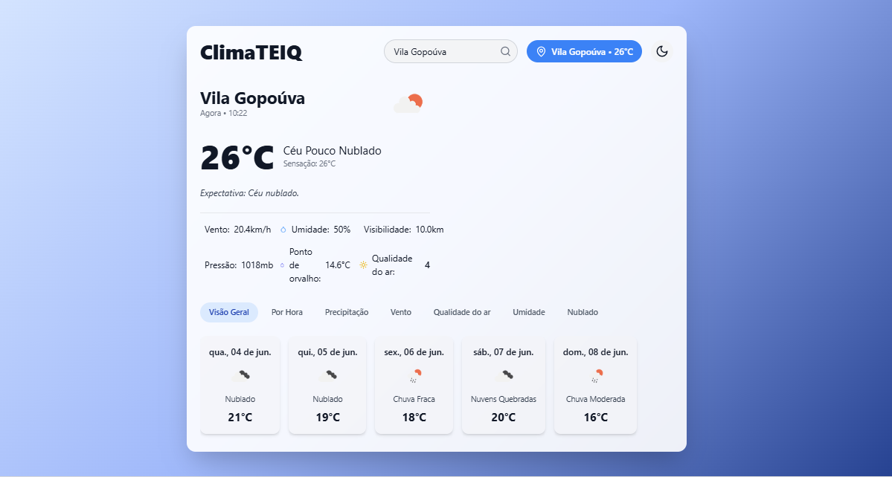

# 🌐 ClimaTEIQ

Um aplicativo web responsivo e moderno para exibir previsões meteorológicas atuais e de cinco dias.Possui abas para diferentes categorias de dados, modo claro/escuro e fundo em gradiente de tons de azul.

---

## 📷 Captura de tela




## 💡 Principais Funcionalidades

- 🔍 **Busca por cidade**  
  - Campo de texto com ícone de lupa clicável (ou pressionar Enter) para pesquisar qualquer cidade (ex.: “São Paulo, BR”).

- 📍 **“Minha localização”**  
  - Botão que utiliza a geolocalização do navegador para identificar automaticamente a cidade atual.

- 🌤️ **Clima Atual**  
  - Exibe:
    - Nome da cidade e horário local atualizado.
    - Ícone representando a condição meteorológica.
    - Temperatura (°C), descrição e “sensação térmica”.
    - Frase-resumo baseada na condição principal (céu limpo, nublado, chuva etc.).
    - Dados adicionais: vento (km/h), umidade (%), visibilidade (km), pressão (mb), ponto de orvalho (°C) e Índice de Qualidade do Ar (AQI).

- 📅 **Previsão para 5 dias**  
  - Aba “Visão Geral” com scroll horizontal de cards para cada um dos próximos 5 dias:
    - Data formatada (Ex.: “Qua, 18 Jun”).
    - Ícone do clima (48×48).
    - Descrição breve (capitalizada).
    - Temperatura média diária (°C).

- 🌗 **Modo Claro / Escuro**  
  - Alternância entre temas ao clicar no botão “lua/sol”.  
  - A preferência é salva no `localStorage` do navegador.

- 🎨 **Layout Moderno**  
  - **Fundo**: gradiente fixo em tons de azul (' #d9e8ff',' #9eb7fa','#1e3a8a'), cobrindo toda a tela.  
  - **Container Principal**: fundo branco (modo claro) ou cinza escuro (modo escuro) com opacidade e efeito “glassmorphism” (`backdrop-blur`).  
  - **Responsividade**: em telas grandes, o conteúdo principal está em duas colunas; nos dispositivos móveis, empilha verticalmente.  
  - **Abas (Tabs)**: barras horizontais para navegar entre “Visão Geral”, “Por Hora”, “Precipitação”, “Vento”, “Qualidade do ar”, “Umidade” e “Nublado”. Cada aba exibe seu respectivo conteúdo (algumas ainda “em construção”).

- 🚀 **Animações**  
  - Uso de Animate.css para transições suaves:  
    - `.animate__fadeIn` ao carregar o container principal.  
    - `.animate__fadeInUp` para exibição dos cards de previsão e do painel de clima.

---

## 🗂️ Estrutura de Arquivos


- **index.html**  
  - Inclui:  
    - Tailwind CSS via CDN  
    - Animate.css  
    - Lucide Icons  
    - HTML estruturado com classes utilitárias do Tailwind para layout, responsividade e estilo.  
    - Cabeçalho com campo de busca, botão “Minha localização” e botão de tema.  
    - Seção de clima atual (painel esquerdo).  
    - Painel direito permanece transparente para manter duas colunas.  
    - Abas para diferentes tipos de dados.  
    - Chama `script.js` ao final do `body`.

- **script.js**  
  - Mantém toda a lógica em JavaScript puro (ES6+):  
    1. **Dark Mode**: alterna classe `dark` no `<html>` e salva preferência no `localStorage`.  
    2. **getWeatherByCity(city)**:  
       - Faz `fetch` à API OpenWeatherMap para clima atual (Current Weather).  
       - Faz `fetch` à Air Pollution API (AQI).  
       - Faz `fetch` à Forecast API (5 dias / 3 horas).  
       - Preenche o painel esquerdo com os dados obtidos.  
       - Gera dinamicamente cards de previsão para os próximos 5 dias na aba “Visão Geral”.  
    3. **getWeatherByCurrentLocation()**:  
       - Usa `navigator.geolocation` para obter latitude/longitude.  
       - Converte em nome de cidade e dispara `getWeatherByCity(...)`.  
    4. **displayCurrentWeather(data, airData)**: popula campos: cidade, hora local, ícone, descrição, temperatura, sensação térmica, resumo, vento, umidade, visibilidade, pressão, ponto de orvalho e AQI.  
    5. **displayForecast(forecastData)**: agrupa por data (YYYY-MM-DD), seleciona horário mais próximo das 12:00 ou o primeiro registro, formata data, exibe ícone e temperatura em cards de 120px de largura.  
    6. **initTabs()**: adiciona evento de clique às abas, alterna estilos das abas ativas e oculta/mostra o conteúdo de cada aba.  
    7. **Funções auxiliares**: cálculo de ponto de orvalho (fórmula de Arden Buck), capitalização de strings e resumo textual da condição principal (`getSummaryByWeatherMain`).  

---

## ⚙️ Como Configurar e Executar

1. **Clone ou baixe** este repositório para sua máquina local:
   ```bash
   git clone https://github.com/seu-usuario/climate-realistic.git
   cd climate-realistic.
2.Adquira uma chave de API no OpenWeatherMap:

Acesse: https://openweathermap.org/api

Crie uma conta gratuita ou faça login.

No painel de “API keys”, copie sua chave (Ex.: abcdef1234567890...).

3.Na linha 2, substitua:

const apiKey = 'SUA_CHAVE_AQUI';


Feito com 💚 por [Michelle Bispo] https://github.com/Silvami223
